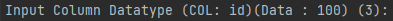

[1]: https://www.w3schools.com/sql/sql_datatypes.asp "W3Schools SQL Datatypes"
# JoelUrwin's Delimiter Converter

This package is built as a part of a personal project licensed under the GNU GENERAL PUBLIC LICENSE.

Type `python main.py --help` to see some useful information.

#### `usage: main.py [-h] [--json] [--yml] [--sql] [--enum] [--csv] [-p] -f F`

## CLI Arguments
* ``--h, --help`` Opens the help menu.
* ``--json`` Converts the inputted CSV to JSON.
* ``--yml`` Converts the inputted CSV to YAML.
* ``--enum`` Converts the inputted CSV to a Java ENUM.
* ``--sql`` Converts the inputted CSV to SQL Schema (`CREATE TABLE and INSERT INTO`)
* ``--p`` Automatically input Column Titles (*Ensure they are at Line 1 of the CSV*)
* ``-f (filename/path)`` File input (**Required**)

## Installation
* Clone the Repo
* CD into the Repo
* Ensure that the requirements are installed by entering `pip install -r requirements.txt` into the terminal.

## Example usages

### Converting CSV to SQL
1. Get your CSV File, for this example, I will be using random sample data.
2. Make sure that your data is correctly assembled in CSV, the program has some wiggle room however clean data works best.

* (Our Example Data)
3. Run the program, since we already have the column names defined, add `-p` to our CLI Command, Otherwise the program will ask for column names to be inputted.
4. Input the table name and filename you want (this will be `filename.sql`)

5. Specify the data types for each column, if you're unsure, consult [this link][1].

6. Follow through the SQL Wizard and enjoy your generated schema!

|     |
|-----|
|     |

#### Results!!!!